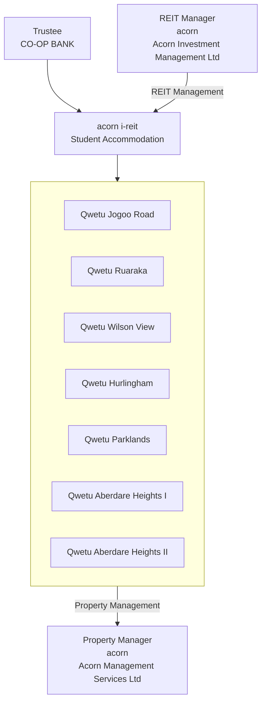

## 2023 Annual Report

# POSITIONED FOR GROWTH

---

JPROJA

**DISCLAIMER**

This report contains forward-looking statements that involve assumptions, risks and uncertainties. Actual future performance, outcomes and results may differ materially from those expressed in the forward-looking statements resulting from factors which include, inter alia, general industry and economic conditions, cost of capital and capital availability, occupancy rates, stabilization period of occupancy, changes in operating expenses, and public policy. The value of the units in the ASA I-REIT and the realized capital gain may fall and rise as they are subject to investment risks.

---

# Table of Contents

##  ASA I-REIT AT A GLANCE

* Who We Are 8
* Structure Of The Asa I-Reit 9
* ASA I-REIT At A Glance 10
* Key Operational Highlights 11
* What Qwetu Means To Our Residents 12
* Key Financial Highlights 13
* Investment Case 14

## 2 STRATEGIC REPORT

* Chairperson’s Statement 18
* Executive Director’s Statement 20
* Macroeconomic Review 26
* Our Business Model 30
* ASA I-REIT Returns 31
* Sustainability Report 34
* Highlights of 2023 36

## 3 REPORTING

* Environmental Performance Measures and Impact 40
* Health And Safety Report 51
* Risk Management 55
* Report Of The Reit Manager 59
* ASA I-REIT Assets 61
* Property Highlights 64
* Portfolio Update 65
* Financial Performance 73
* Compliance With Regulatory Limits 82
* Asset Holdings Versus Prescribed Limits 83

## 4 GOVERNANCE

* REIT Manager’s Board Of Directors 88
* REIT Management Team 92
* Corporate Governance Report 98
* Reit Manager Compliance Report 105
* Report Of The Trustee 106
* Shariah Compliance 108

## 5 FINANCIAL STATEMENTS

* Report of the REIT Manager 114
* Certification of the Financial Statements by the Trustee 118
* Statement of REIT Manager’s responsibilities 119
* Independent Auditor’s Report 120
* Consolidated Statement Of Profit or Loss and Other Comprehensive Income 125

* The ASA-IREIT Statement of Profit or Loss and Other Comprehensive Income 127
* The ASA-IREIT Statement of Financial Position 128
* Consolidated Statement of changes in Trust’s Equity 129
* The ASA-IREIT Statement of changes in Trust’s Equity 130
* Consolidated Statement of Cash Flows 131
* The ASA-IREIT Statement of Cash Flows 132
* Notes to the Financial Statements 133

## 6 OTHER INFORMATION

* Glossary 180
* Our Information 183

---

# 1 ASA I-REIT AT A GLANCE

* **Who We Are** 8
* **Structure Of The Asa I-Reit** 9
* **Asa I-Reit At A Glance** 10
* **Key Operational Highlights** 11
* **What Qwetu Means To Our Residents** 12
* **Key Financial Highlights** 13
* **Investment Case** 14

---

# WHO WE ARE

We are Kenya’s largest owner and operator of purpose-built student accommodation, (“PBSA”). We are also Africa’s first Student Accommodation Income Real Estate Investment Trust (“I-REIT”).

## Mission
Transform and improve the living conditions of the people of Urban Africa by creating sustainable and resilient communities using innovative and ground-breaking capital market products and financial instruments.

## Vision
To become the premier developer, owner, and manager of rental housing in sub-Saharan Africa conducting our activities in a sustainable, responsible, and environmentally conscious way.

## Unique Value Proposition

### Creating communities
We create the places and residences that provide the common ground for like-minded young people to form homogenous communities that have shared lifestyles, interests, and values.

### Creating wealth and financial freedom
We have created various investment products and capital market issuances for institutional and retail investors to accumulate wealth and achieve financial freedom.

# STRUCTURE OF THE ASA I-REIT

The ASA I-REIT is held in trust by the Trustee (Co-operative Bank of Kenya, “Co-op Bank”) and professionally managed by a REIT Manager (Acorn Investment Management Limited, “AIML”). The properties in the ASA I-REIT are professionally managed by a Property Manager (Acorn Management Services Limited, “AMSL”)

